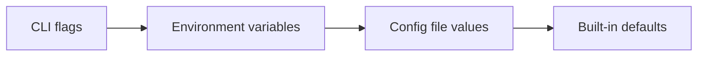

# Configuration Priority Hierarchy

## Configuration hierarchy

One can override the settings in `inkeep.config.ts` by setting the following settings in this order (highest to lowest priority):



### 1. CLI Flags

Command-line flags override all other settings:

```bash
# Override API URL
inkeep push --agents-manage-api-url https://api.production.com

# Override config file location
inkeep pull --config /path/to/custom.config.ts
```

### 2. Environment Variables

Environment variables override config file values:

```bash
# Set via environment
export INKEEP_TENANT_ID=staging-tenant
export INKEEP_AGENTS_MANAGE_API_URL=https://api.staging.com
export INKEEP_AGENTS_RUN_API_URL=https://run.staging.com

# Now CLI commands use these values
inkeep push
```

**Supported Environment Variables:**

| Variable                       | Config Equivalent    | Description        |
| ------------------------------ | -------------------- | ------------------ |
| `INKEEP_TENANT_ID`             | `tenantId`           | Tenant identifier  |
| `INKEEP_AGENTS_MANAGE_API_URL` | `agentsManageApiUrl` | Management API URL |
| `INKEEP_AGENTS_RUN_API_URL`    | `agentsRunApiUrl`    | Runtime API URL    |
